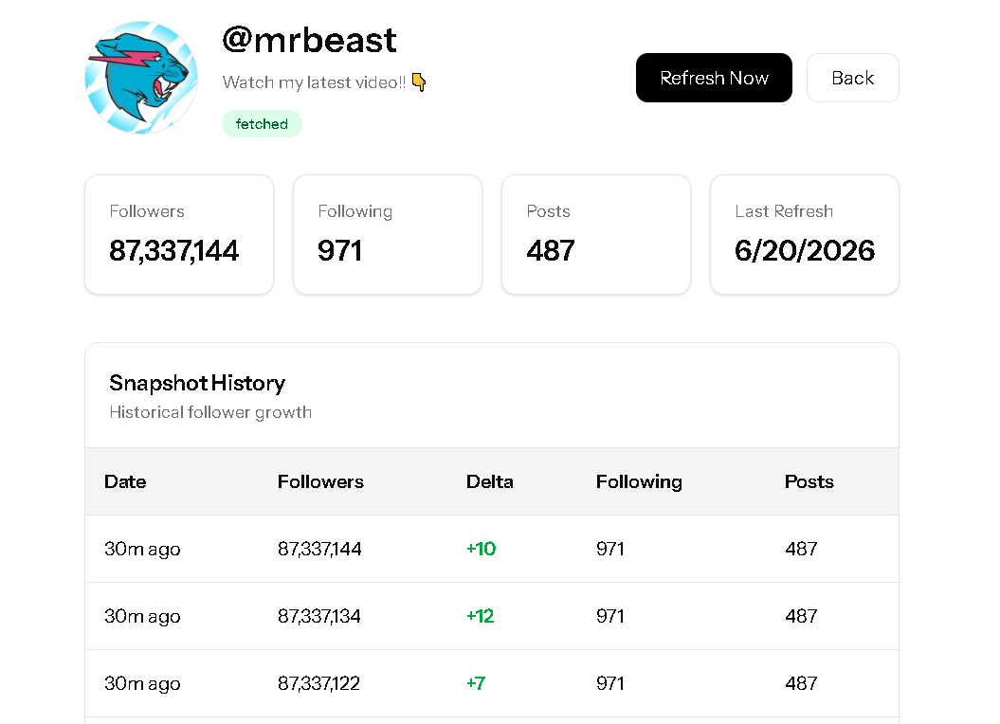

# MiniInfluencer

MiniInfluencer is a Laravel + React (Inertia.js) application that tracks Instagram influencers and stores historical profile snapshots over time.

The application allows administrators to:

* Add Instagram usernames to a watchlist
* Fetch profile data asynchronously through queued jobs
* Track followers, following count, posts, bio, and profile picture
* View snapshot history of profile metrics
* Refresh profile data on demand
* Monitor job health and API rate limits

This project was built as part of the Exhibit Social Full-Stack Developer Take-Home Assignment.


---

# Tech Stack

## Backend

* Laravel 12
* PHP 8.3
* PostgreSQL
* Laravel Queue (Database Driver)

## Frontend

* React 19
* TypeScript
* Inertia.js v2
* Tailwind CSS

## External Provider

* Apify Instagram Scraper

---

# Features Implemented

## Core Features

* Add Instagram profiles
* Background profile fetching
* Profile detail page
* Snapshot history tracking
* Manual profile refresh
* Status tracking (pending, fetching, fetched, failed)
* Profile metrics storage
* Profile image and bio support

## System Features

### Background Jobs

All API calls are executed inside `FetchProfileJob`.

Controller actions only dispatch jobs and return immediately.

### Concurrency Protection

Implemented using PostgreSQL Advisory Locks.

```sql
SELECT pg_try_advisory_lock(profile_id)
```

If another worker is already processing the same profile, the second worker exits without making an API request.

Reason for choosing advisory locks:

* Native PostgreSQL feature
* No additional infrastructure required
* Fast and lightweight
* Automatically scoped to database connections

### Retry Classification

Implemented using a custom `ProfileFetchException`.

| Status          | Classification |
| --------------- | -------------- |
| 404             | Fatal          |
| 401             | Fatal          |
| 429             | Retriable      |
| 5xx             | Retriable      |
| Invalid Payload | Fatal          |

Fatal failures immediately mark the profile as failed.

Retriable failures use exponential backoff.

### Token Bucket Rate Limiter

Implemented using Laravel Cache.

Configuration:

* Capacity: 100 tokens
* Refill Rate: 10 tokens per minute
* Cost: 1 token per API request

If no tokens remain:

* API request is skipped
* Job is re-dispatched with exponential delay
* Request does not count as a failed attempt

### Circuit Breaker

Implemented using Laravel Cache.

Rules:

* Opens after 10 consecutive failures
* Remains open for 2 minutes
* New jobs are deferred while open
* Successful requests reset the failure count

State Flow:

Closed
↓
10 Consecutive Failures
↓
Open (2 Minutes)
↓
Test Request
↓
Success → Closed
Failure → Open

### Webhook Security

Implemented endpoint:

```text
POST /webhooks/{provider}
```

Security features:

* HMAC signature verification
* Shared secret stored in environment variables
* Replay protection using nonce storage
* Async processing through queued jobs

### Health Endpoints

```text
GET /healthz
GET /health/rate-limit
```

Used to monitor service availability and token bucket status.

---

# Installation

## Clone Repository

```bash
git clone <repository-url>
cd miniinfluencer
```

## Install Dependencies

```bash
composer install
npm install
```

## Environment Setup

```bash
cp .env.example .env
```

Generate application key:

```bash
php artisan key:generate
```

## Configure Environment Variables

Required values:

```env
APP_NAME=MiniInfluencer

DB_CONNECTION=pgsql
DB_HOST=127.0.0.1
DB_PORT=5432
DB_DATABASE=miniinfluencer
DB_USERNAME=postgres
DB_PASSWORD=your_password

QUEUE_CONNECTION=database
CACHE_STORE=database

APIFY_TOKEN=your_apify_token

WEBHOOK_SECRET=your_webhook_secret
```

## Database Setup

```bash
php artisan migrate
```

## Queue Setup

```bash
php artisan queue:work
```

## Frontend

```bash
npm run dev
```

## Start Application

```bash
php artisan serve
```

---

# Assumptions

* Instagram profile data is fetched through Apify.
* Database queue driver is sufficient for assignment scope.
* Cache database driver is used instead of Redis in local development.

---

# Trade-Offs

## Queue Driver

Used Laravel Database Queue instead of Redis because it simplifies local development and reduces setup complexity.

## Cache Driver

Used Database Cache instead of Redis due to local development environment constraints. In production, Redis would be preferred for higher throughput.

---

